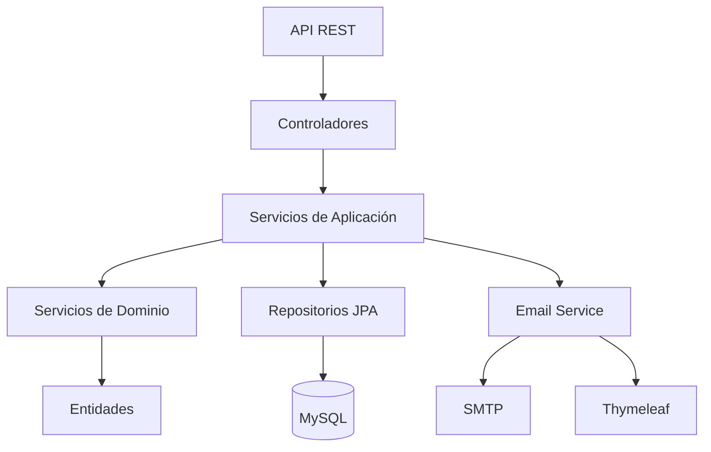
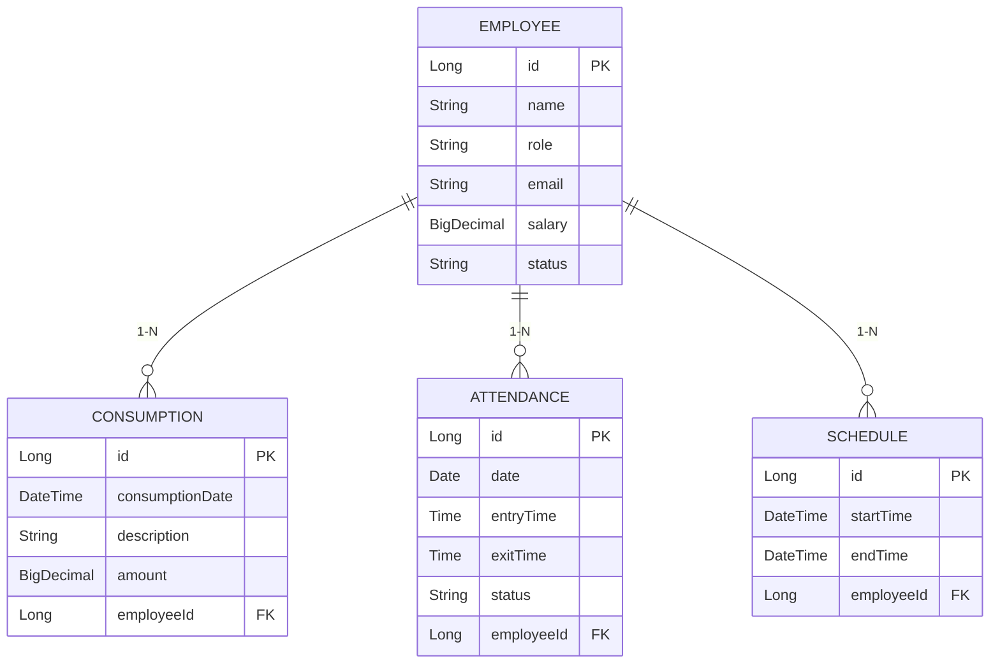

#  **Sistema Inteligente de Gestión de Empleados**

### Un Bar Moderno en David, Chiriquí, Panamá

<div align="center">
  
  
  
  
  
</div>

---

## 💡 **Acerca del Proyecto**

Este proyecto es un sistema integral para la gestión de empleados de un bar, compuesto por un backend robusto y un frontend moderno y reactivo. La aplicación automatiza procesos clave como la administración de empleados, control de consumos, registro de asistencia, planificación de horarios y generación de reportes.

---

## ✨ **Características Principales**

### Backend (Java & Spring Boot)
- **👥 Gestión de Empleados:** CRUD completo con validaciones avanzadas.
- **🍹 Control de Consumos:** Registro detallado y cálculo de totales.
- **⏱️ Registro de Asistencia:** Sistema de check-in/check-out y cálculo de horas.
- **📅 Planificación de Horarios:** Asignación flexible de turnos.
- **✉️ Reportes Automatizados:** Generación semanal y envío por email con Thymeleaf.

### Frontend (Vue.js & Quasar)
- **🖥️ Interfaz Intuitiva:** Diseño amigable y fácil de usar con Quasar Framework.
- **⚡ Reactividad:** Experiencia de usuario fluida y dinámica con Vue.js 3.
- **📱 Adaptable:** Diseño responsivo para diferentes dispositivos.
- **🔒 Gestión de Autenticación:** Rutas protegidas y manejo de sesiones.

---

## 🛠️ **Tecnologías Principales**

<div align="center">
  <table>
    <tr>
      <td align="center" width="96">
        
        <br>Java 17+
      </td>
      <td align="center" width="96">
        
        <br>Spring Boot 3.2
      </td>
      <td align="center" width="96">
        
        <br>Vue.js 3
      </td>
      <td align="center" width="96">
        
        <br>Quasar 2
      </td>
      <td align="center" width="96">
        
        <br>MySQL 8.0
      </td>
    </tr>
  </table>
</div>

---

## 🚀 **Comenzando**

### Prerrequisitos
- JDK 17+
- Maven 3.6+
- Node.js 16+
- Yarn o NPM
- MySQL 8.x (opcional, puede usar H2 en memoria)

### Configuración y Ejecución

#### Backend
1. **Navegar al directorio del backend:**
   ```bash
   cd backend
   ```
2. **Configurar base de datos** (en `src/main/resources/application.properties`):
   ```properties
   # Para desarrollo con H2
   spring.datasource.url=jdbc:h2:mem:testdb
   
   # Para producción con MySQL
   spring.datasource.url=jdbc:mysql://localhost:3306/bar_db
   spring.datasource.username=usuario
   spring.datasource.password=contraseña
   spring.flyway.locations=classpath:/db/migration
   ```
3. **Configurar email** (ejemplo para Gmail):
   ```properties
   spring.mail.host=smtp.gmail.com
   spring.mail.port=587
   spring.mail.username=tu-email@gmail.com
   spring.mail.password=app-password
   spring.mail.properties.mail.smtp.starttls.enable=true
   ```
4. **Ejecutar la aplicación:**
   ```bash
   mvn spring-boot:run
   ```
La API estará disponible en: `http://localhost:8080/api`

#### Frontend
1. **Navegar al directorio del frontend:**
   ```bash
   cd frontend
   ```
2. **Instalar dependencias:**
   ```bash
   yarn
   # o
   npm install
   ```
3. **Iniciar en modo de desarrollo:**
   ```bash
   quasar dev
   ```
La aplicación estará disponible en `http://localhost:9000`.

---

## ⚙️ **Arquitectura del Sistema (Backend)**



---

## 🌟 **Endpoints de la API**

La aplicación expone varios endpoints REST para la gestión de empleados, asistencia, consumos, horarios e informes. Todos los endpoints están prefijados con `/v1`.

### 1. Gestión de Empleados (`/v1/employees`)
*   **`POST /`**: Crea un nuevo empleado.
*   **`GET /{id}`**: Obtiene un empleado por su ID.
*   **`GET /`**: Obtiene todos los empleados.
*   **`PUT /{id}`**: Actualiza un empleado existente.
*   **`PATCH /{id}/hourly-rate`**: Actualiza la tarifa por hora de un empleado.
*   **`DELETE /{id}`**: Elimina un empleado.
*   **`GET /search`**: Busca empleados por estado, nombre o rol.

### 2. Gestión de Horarios (`/v1/schedules`)
*   **`POST /`**: Crea un nuevo horario para un empleado.
*   **`GET /{id}`**: Obtiene un horario por su ID.
*   **`GET /employee/{employeeId}`**: Obtiene todos los horarios para un empleado específico.
*   **`PUT /{id}`**: Actualiza un horario existente.
*   **`DELETE /{id}`**: Elimina un horario.

### 3. Gestión de Asistencia (`/v1/attendance`)
*   **`POST /`**: Registra la asistencia de un empleado (horas de entrada/salida).
*   **`GET /list`**: Obtiene los registros de asistencia por empleado y rango de fechas.
*   **`GET /percentage`**: Calcula el porcentaje de asistencia de un empleado para un día específico.

### 4. Gestión de Consumos (`/v1/consumptions`)
*   **`POST /`**: Registra un nuevo consumo para un empleado.
*   **`GET /total`**: Obtiene el total de consumos para un empleado dentro de un rango de fechas.
*   **`GET /total/all`**: Obtiene el total de consumos para todos los empleados dentro de un rango de fechas.

### 5. Informes (`/v1/reports`)
*   **`GET /complete`**: Genera un informe operativo completo (asistencia, consumo, ganancias) para un empleado o todos los empleados dentro de un rango de fechas.
*   **`GET /payment`**: Calcula el pago total para un empleado dentro de un rango de fechas.
*   **`POST /weekly`**: Activa la generación del informe semanal del gerente.
*   **`GET /weekly/pdf`**: Descarga el informe semanal del gerente en formato PDF.

### 6. Gestión de KPIs (`/v1/kpis`)
*   **`GET /manager`**: Recupera los Indicadores Clave de Rendimiento (KPIs) para gerentes para un rango de fechas dado.

### 7. Autenticación (`/v1/auth`)
*   **`POST /login`**: Autentica a un usuario y recibe un token JWT.
*   **`POST /register-manager`**: Registra un nuevo usuario gerente (configuración inicial).

### 8. Gestión de Usuarios (`/v1/users`)
*   **`POST /`**: Crea un nuevo usuario (requiere rol MANAGER).
*   **`DELETE /{id}`**: Elimina un usuario (requiere rol ADMIN o MANAGER).
*   **`PUT /{id}/role`**: Actualiza el rol de un usuario (requiere rol ADMIN o MANAGER).

---

## 🧪 **Estrategia de Pruebas**

El proyecto emplea una estrategia de pruebas integral centrada principalmente en **pruebas de integración** para la capa API, asegurando la correcta interacción entre controladores, servicios de aplicación y capas de persistencia.

---

## 📊 **Modelo de Datos (Backend)**



---

## 🛡️ **Seguridad y Validación**

- **Validaciones:** Se utilizan anotaciones como `@NotBlank`, `@Email`, `@Positive`, y `@Future` para asegurar la integridad de los datos.
- **Manejo de errores:** Se implementa un manejo de errores centralizado para respuestas consistentes (`400`, `404`, `409`, `500`).
- **Seguridad:** Autenticación basada en JWT y autorización por roles (MANAGER, ADMIN, USER).

---

## 🤝 **Cómo Contribuir**

1. Haz fork del repositorio.
2. Crea una rama para tu feature (`git checkout -b feature/nueva-funcionalidad`).
3. Realiza tus cambios y commitea.
4. Haz push a la rama (`git push origin feature/nueva-funcionalidad`).
5. Abre un Pull Request.

---

## 📄 **Licencia**

Distribuido bajo licencia MIT. Ver `LICENSE.md` para detalles.

---

<div align="center">
  
</div>
