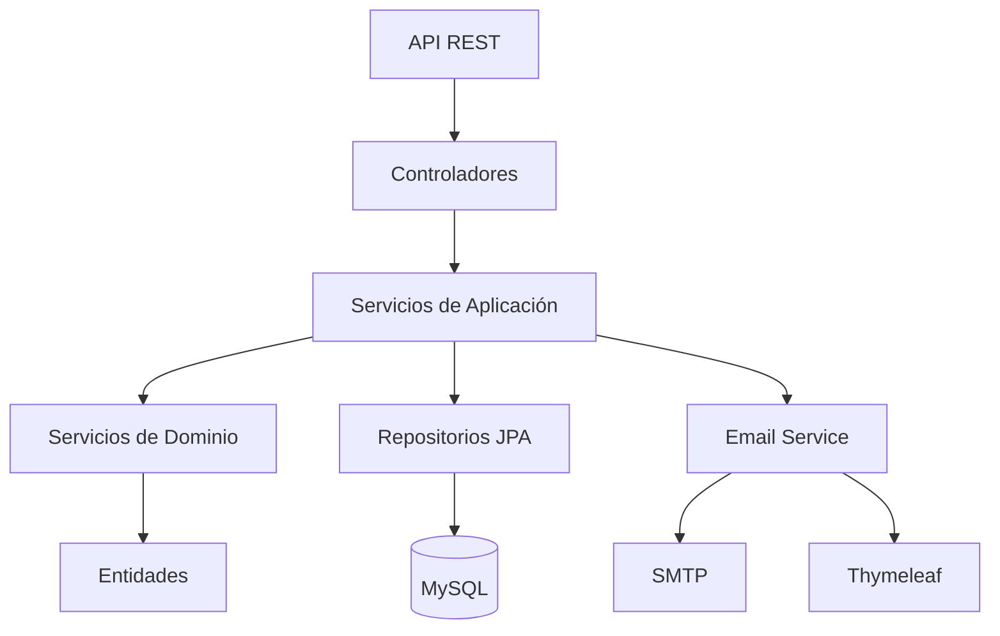
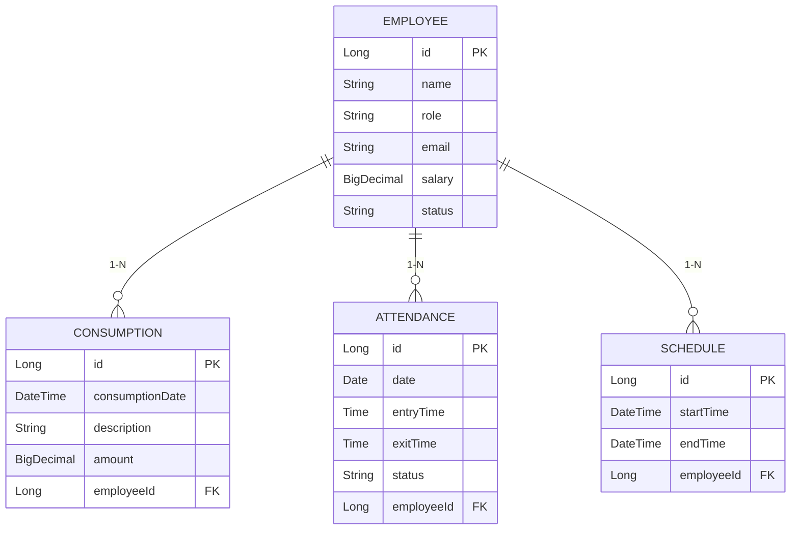

# 🚀 **Sistema Inteligente de Gestión de Empleados**

### Un Bar Moderno en David, Chiriquí, Panamá

<div align="center">
  
  
  
  
  
  
  
</div>

-----

## 💡 **Acerca del Proyecto**

Sistema backend desarrollado con **Java 17+** y **Spring Boot 3.2.3** para la gestión integral del personal en el bar "La Esquina Bohemia". Automatiza procesos clave como:

- Administración completa de empleados
- Control detallado de consumos internos
- Registro preciso de asistencia
- Planificación flexible de horarios
- Generación automática de reportes por email

-----

## ✨ **Características Principales**

### 👥 Gestión de Empleados
- CRUD completo con validaciones avanzadas
- Búsqueda por múltiples criterios (estado, rol, nombre)
- Manejo de salarios y estados de empleados

### 🍹 Control de Consumos
- Registro detallado con fecha, descripción y monto
- Cálculo de totales por empleado o períodos específicos
- Historial completo de consumos

### ⏱️ Registro de Asistencia
- Sistema de check-in/check-out
- Cálculo automático de horas trabajadas
- Reportes de asistencia diaria/semanal

### 📅 Planificación de Horarios
- Asignación flexible de turnos
- Validación de conflictos de horarios
- Visualización clara de calendarios

### ✉️ Reportes Automatizados
- Generación semanal automática
- Plantillas HTML profesionales con Thymeleaf
- Envío asíncrono por email

-----

## ⚙️ **Arquitectura del Sistema**



**Flujo típico:**
1. Petición HTTP llega al controlador
2. Servicio de aplicación orquesta la operación
3. Servicio de dominio ejecuta lógica de negocio
4. Repositorio persiste/recupera datos
5. Respuesta estructurada retornada al cliente

-----

## 🛠️ **Tecnologías Principales**

<div align="center">
  <table>
    <tr>
      <td align="center" width="96">
        
        <br>Java 17+
      </td>
      <td align="center" width="96">
        
        <br>Spring Boot 3.2
      </td>
      <td align="center" width="96">
        
        <br>MySQL 8.0
      </td>
    </tr>
  </table>
</div>

-----

## 🚀 **Comenzando**

### Prerrequisitos
- JDK 17+
- Maven 3.6+
- MySQL 8.x (opcional)

### Configuración Inicial
1. Clonar repositorio:
   ```bash
   git clone https://github.com/tu-usuario/bar-management-system.git
   cd bar-management-system
   ```

2. Configurar base de datos (en `application.properties`):
   ```properties
   # Para desarrollo con H2
   spring.datasource.url=jdbc:h2:mem:testdb
   
   # Para producción con MySQL
   spring.datasource.url=jdbc:mysql://localhost:3306/bar_db
   spring.datasource.username=usuario
   spring.datasource.password=contraseña
   spring.flyway.locations=classpath:/db/migration
   ```

3. Configurar email (ejemplo para Gmail):
   ```properties
   spring.mail.host=smtp.gmail.com
   spring.mail.port=587
   spring.mail.username=tu-email@gmail.com
   spring.mail.password=app-password
   spring.mail.properties.mail.smtp.starttls.enable=true
   ```

### Ejecución
```bash
mvn spring-boot:run
```

La API estará disponible en: `http://localhost:8080/api`

-----

## 📊 **Modelo de Datos**



-----

## 🌟 **Endpoints Clave**

### Empleados (`/api/employees`)
| Método | Ruta | Descripción | Parámetros |
|--------|------|-------------|------------|
| POST   | /    | Crear empleado | EmployeeDto |
| GET    | /{id} | Obtener empleado | ID |
| GET    | /search | Búsqueda | name, role, status |
| PUT    | /{id} | Actualizar | ID, EmployeeDto |
| DELETE | /{id} | Eliminar | ID |

### Consumos (`/api/consumptions`)
| Método | Ruta | Descripción | Parámetros |
|--------|------|-------------|------------|
| POST   | /    | Registrar consumo | ConsumptionDto |
| GET    | /total | Total por empleado | employeeId, startDate, endDate |
| GET    | /total/all | Total general | startDate, endDate |

### Asistencia (`/api/attendances`)
| Método | Ruta | Descripción | Parámetros |
|--------|------|-------------|------------|
| POST   | /    | Registrar asistencia | AttendanceDto |
| GET    | /report | Generar reporte | employeeId, year, month, day |

-----

## 🛡️ **Seguridad y Validación**

**Validaciones implementadas:**
```java
@NotBlank(message = "Nombre es obligatorio")
private String name;

@Email(message = "Email inválido")
private String email;

@Positive(message = "Salario debe ser positivo")
private BigDecimal salary;

@Future(message = "Fecha debe ser futura")
private LocalDate startDate;
```

**Manejo de errores:**
- `400 Bad Request`: Validaciones fallidas
- `404 Not Found`: Recurso no existe
- `409 Conflict`: Violación de reglas de negocio
- `500 Internal Server Error`: Errores inesperados

-----

## 🤝 **Cómo Contribuir**

1. Haz fork del repositorio
2. Crea una rama para tu feature (`git checkout -b feature/nueva-funcionalidad`)
3. Realiza tus cambios y commitea
4. Haz push a la rama (`git push origin feature/nueva-funcionalidad`)
5. Abre un Pull Request

**Requisitos para contribuciones:**
- Incluir tests unitarios para nuevas funcionalidades
- Mantener consistencia de estilo de código
- Documentar cualquier nuevo endpoint en el README
- Actualizar la documentación de cambios importantes

-----

## 📄 **Licencia**

Distribuido bajo licencia MIT. Ver `LICENSE.md` para detalles.

```text
Copyright 2023 La Esquina Bohemia

Permiso otorgado para usar, copiar, modificar y distribuir este software 
y su documentación para cualquier propósito con o sin costo, siempre que 
el aviso de copyright anterior y este permiso aparezcan en todas las copias.
```

-----

<div align="center">
  
</div>
