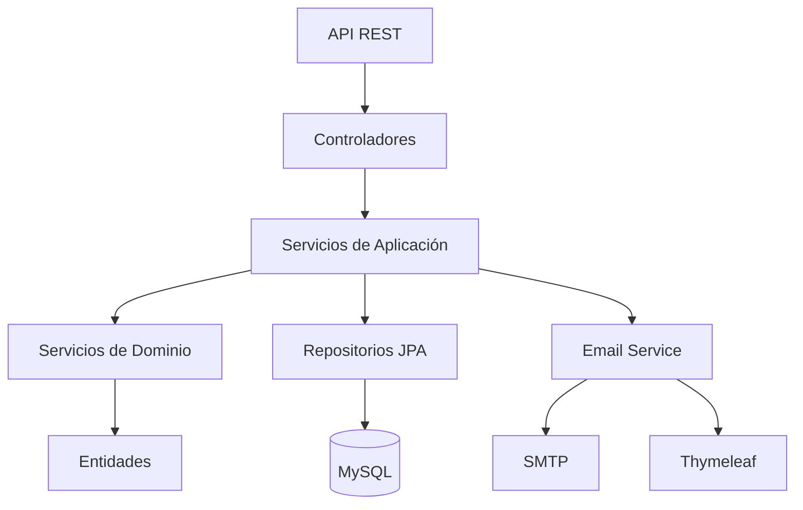
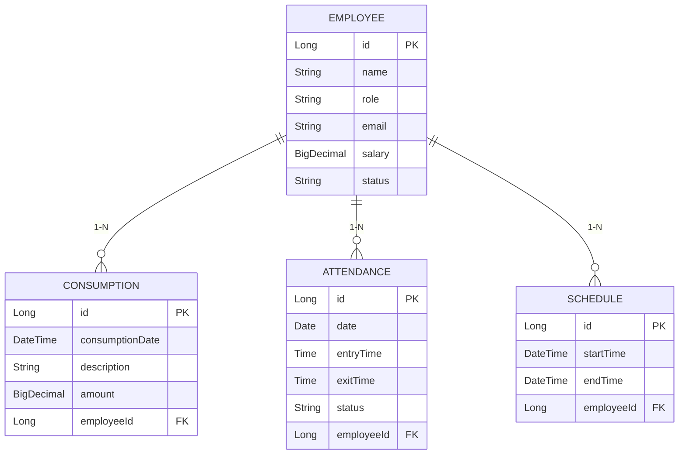

# 🚀 **Sistema Inteligente de Gestión de Empleados**

### Un Bar Moderno en David, Chiriquí, Panamá

<div align="center">
  
  
  
  
  
  
  
</div>

-----

## 💡 **Acerca del Proyecto**

Sistema backend desarrollado con **Java 17+** y **Spring Boot 3.2.3** para la gestión integral del personal en el bar "La Esquina Bohemia". Automatiza procesos clave como:

- Administración completa de empleados
- Control detallado de consumos internos
- Registro preciso de asistencia
- Planificación flexible de horarios
- Generación automática de reportes por email

-----

## ✨ **Características Principales**

### 👥 Gestión de Empleados
- CRUD completo con validaciones avanzadas
- Búsqueda por múltiples criterios (estado, rol, nombre)
- Manejo de salarios y estados de empleados

### 🍹 Control de Consumos
- Registro detallado con fecha, descripción y monto
- Cálculo de totales por empleado o períodos específicos
- Historial completo de consumos

### ⏱️ Registro de Asistencia
- Sistema de check-in/check-out
- Cálculo automático de horas trabajadas
- Reportes de asistencia diaria/semanal

### 📅 Planificación de Horarios
- Asignación flexible de turnos
- Validación de conflictos de horarios
- Visualización clara de calendarios

### ✉️ Reportes Automatizados
- Generación semanal automática
- Plantillas HTML profesionales con Thymeleaf
- Envío asíncrono por email

-----

## ⚙️ **Arquitectura del Sistema**



**Flujo típico:**
1. Petición HTTP llega al controlador
2. Servicio de aplicación orquesta la operación
3. Servicio de dominio ejecuta lógica de negocio
4. Repositorio persiste/recupera datos
5. Respuesta estructurada retornada al cliente

-----

## 🛠️ **Tecnologías Principales**

<div align="center">
  <table>
    <tr>
      <td align="center" width="96">
        
        <br>Java 17+
      </td>
      <td align="center" width="96">
        
        <br>Spring Boot 3.2
      </td>
      <td align="center" width="96">
        
        <br>MySQL 8.0
      </td>
    </tr>
  </table>
</div>

-----

## 🚀 **Comenzando**

### Prerrequisitos
- JDK 17+
- Maven 3.6+
- MySQL 8.x (opcional)

### Configuración Inicial
1. Clonar repositorio:
   ```bash
   git clone https://github.com/tu-usuario/bar-management-system.git
   cd bar-management-system
   ```

2. Configurar base de datos (en `application.properties`):
   ```properties
   # Para desarrollo con H2
   spring.datasource.url=jdbc:h2:mem:testdb
   
   # Para producción con MySQL
   spring.datasource.url=jdbc:mysql://localhost:3306/bar_db
   spring.datasource.username=usuario
   spring.datasource.password=contraseña
   spring.flyway.locations=classpath:/db/migration
   ```

3. Configurar email (ejemplo para Gmail):
   ```properties
   spring.mail.host=smtp.gmail.com
   spring.mail.port=587
   spring.mail.username=tu-email@gmail.com
   spring.mail.password=app-password
   spring.mail.properties.mail.smtp.starttls.enable=true
   ```

### Ejecución
```bash
mvn spring-boot:run
```

La API estará disponible en: `http://localhost:8080/api`

-----

## 🌟 **Endpoints de la API**

La aplicación expone varios endpoints REST para la gestión de empleados, asistencia, consumos, horarios e informes. Todos los endpoints están prefijados con `/v1`.

### 1. Gestión de Empleados (`/v1/employees`)
*   **`POST /`**: Crea un nuevo empleado.
*   **`GET /{id}`**: Obtiene un empleado por su ID.
*   **`GET /`**: Obtiene todos los empleados.
*   **`PUT /{id}`**: Actualiza un empleado existente.
*   **`PATCH /{id}/hourly-rate`**: Actualiza la tarifa por hora de un empleado.
*   **`DELETE /{id}`**: Elimina un empleado.
*   **`GET /search`**: Busca empleados por estado, nombre o rol.

### 2. Gestión de Horarios (`/v1/schedules`)
*   **`POST /`**: Crea un nuevo horario para un empleado.
*   **`GET /{id}`**: Obtiene un horario por su ID.
*   **`GET /employee/{employeeId}`**: Obtiene todos los horarios para un empleado específico.
*   **`PUT /{id}`**: Actualiza un horario existente.
*   **`DELETE /{id}`**: Elimina un horario.

### 3. Gestión de Asistencia (`/v1/attendance`)
*   **`POST /`**: Registra la asistencia de un empleado (horas de entrada/salida).
*   **`GET /list`**: Obtiene los registros de asistencia por empleado y rango de fechas.
*   **`GET /percentage`**: Calcula el porcentaje de asistencia de un empleado para un día específico.

### 4. Gestión de Consumos (`/v1/consumptions`)
*   **`POST /`**: Registra un nuevo consumo para un empleado.
*   **`GET /total`**: Obtiene el total de consumos para un empleado dentro de un rango de fechas.
*   **`GET /total/all`**: Obtiene el total de consumos para todos los empleados dentro de un rango de fechas.

### 5. Informes (`/v1/reports`)
*   **`GET /complete`**: Genera un informe operativo completo (asistencia, consumo, ganancias) para un empleado o todos los empleados dentro de un rango de fechas.
*   **`GET /payment`**: Calcula el pago total para un empleado dentro de un rango de fechas.
*   **`POST /weekly`**: Activa la generación del informe semanal del gerente.
*   **`GET /weekly/pdf`**: Descarga el informe semanal del gerente en formato PDF.

### 6. Gestión de KPIs (`/v1/kpis`)
*   **`GET /manager`**: Recupera los Indicadores Clave de Rendimiento (KPIs) para gerentes para un rango de fechas dado.

### 7. Autenticación (`/v1/auth`)
*   **`POST /login`**: Autentica a un usuario y recibe un token JWT.
*   **`POST /register-manager`**: Registra un nuevo usuario gerente (configuración inicial).

### 8. Gestión de Usuarios (`/v1/users`)
*   **`POST /`**: Crea un nuevo usuario (requiere rol MANAGER).
*   **`DELETE /{id}`**: Elimina un usuario (requiere rol ADMIN o MANAGER).
*   **`PUT /{id}/role`**: Actualiza el rol de un usuario (requiere rol ADMIN o MANAGER).

-----

## 🧪 **Estrategia de Pruebas**

El proyecto emplea una estrategia de pruebas integral centrada principalmente en **pruebas de integración** para la capa API, asegurando la correcta interacción entre controladores, servicios de aplicación y capas de persistencia.

### Pruebas de Integración (`src/test/java/com/employed/bar/controller/app/`)

Estas pruebas simulan solicitudes HTTP a los endpoints de la API REST y verifican las respuestas, incluyendo códigos de estado, cargas útiles JSON y manejo de errores. Cubren:

*   **Escenarios Válidos**: Creación, recuperación, actualización y eliminación exitosa de recursos.
*   **Entrada Inválida**: Manejo de solicitudes mal formadas, parámetros faltantes y datos inválidos (ej. montos negativos, rangos de fechas inválidos, horarios superpuestos).
*   **Recursos No Existentes**: Respuestas `404 Not Found` adecuadas para solicitudes que involucran IDs o empleados no existentes.
*   **Seguridad**: Autenticación (`401 Unauthorized`) y Autorización (`403 Forbidden`) para diferentes roles de usuario (MANAGER, ADMIN, WAITER).
*   **Casos Límite**: Escenarios específicos como horarios en días diferentes, listas vacías y límites de rango de fechas.

**Archivos Clave de Pruebas de Integración:**

*   `AttendanceControllerTest.java`: Pruebas para el registro y recuperación de asistencia.
*   `ConsumptionControllerTest.java`: Pruebas para el registro de consumos y cálculos totales.
*   `EmployeeControllerTest.java`: Pruebas para operaciones CRUD de empleados y búsqueda.
*   `ReportControllerTest.java`: Pruebas para la generación de varios informes y cálculos de pago.
*   `ScheduleControllerTest.java`: Pruebas para la creación, actualización, eliminación y recuperación de horarios, incluyendo la validación de horarios superpuestos.
*   `KpiControllerTest.java`: Pruebas para la recuperación de Indicadores Clave de Rendimiento.
*   `ManagerReportControllerTest.java`: Pruebas para la generación de informes específicos del gerente y descargas en PDF.
*   `NotificationControllerTest.java`: Pruebas para el envío de correos electrónicos de prueba.
*   `AuthControllerTest.java`: Pruebas para el inicio de sesión de usuarios y el registro de gerentes.
*   `UserManagementControllerTest.java`: Pruebas para la creación, eliminación y actualización de roles de usuario, incluyendo reglas de autorización complejas.

### Pruebas Unitarias (Implícito)

Aunque el enfoque de esta documentación está en las pruebas de integración, la arquitectura hexagonal implica que las pruebas unitarias también son cruciales para:

*   **Capa de Dominio**: Verificar la lógica de negocio central independiente de las preocupaciones de la aplicación o la infraestructura.
*   **Capa de Aplicación (Casos de Uso)**: Probar la orquestación de las reglas de negocio y las interacciones con los puertos, a menudo utilizando mocks para los puertos de salida.

-----

## 📊 **Modelo de Datos**



-----

## 🛡️ **Seguridad y Validación**

**Validaciones implementadas:**
```java
@NotBlank(message = "Nombre es obligatorio")
private String name;

@Email(message = "Email inválido")
private String email;

@Positive(message = "Salario debe ser positivo")
private BigDecimal salary;

@Future(message = "Fecha debe ser futura")
private LocalDate startDate;
```

**Manejo de errores:**
- `400 Bad Request`: Validaciones fallidas
- `404 Not Found`: Recurso no existe
- `409 Conflict`: Violación de reglas de negocio
- `500 Internal Server Error`: Errores inesperados

-----

## 🤝 **Cómo Contribuir**

1. Haz fork del repositorio
2. Crea una rama para tu feature (`git checkout -b feature/nueva-funcionalidad`)
3. Realiza tus cambios y commitea
4. Haz push a la rama (`git push origin feature/nueva-funcionalidad`)
5. Abre un Pull Request

**Requisitos para contribuciones:**
- Incluir tests unitarios para nuevas funcionalidades
- Mantener consistencia de estilo de código
- Documentar cualquier nuevo endpoint en el README
- Actualizar la documentación de cambios importantes

-----

## 📄 **Licencia**

Distribuido bajo licencia MIT. Ver `LICENSE.md` para detalles.

```text
Copyright 2023 La Esquina Bohemia

Permiso otorgado para usar, copiar, modificar y distribuir este software 
y su documentación para cualquier propósito con o sin costo, siempre que 
el aviso de copyright anterior y este permiso aparezcan en todas las copias.
```

-----

<div align="center">
  
</div>